# Git Branching and Merging

## part 3: Mergng chnages 
After both Tom and Jerry have made their changes, you or (other team memebrs) can review and merge their changes into the main project.This process involves:
1. Creating pull requests
2. Merging the Pull Requests into **main** branch
## Understanding Pull Requests:
**A pull request (PR)** is a feature used in Github (and other Git based version control system) that allows you to notify team members about the changes you've pushed to a repository. Essentially, it is a request review and pull in your contribution to the main project. Pull requests are central to the collaboration development process, enabling team members to discuss, review, and make further before merging changes.

## How to create a Pull Request on GitHub:
After Tom and Jerry have pushed their changes to their respective branches, they can create pull requests for each of them. Here's how Tom would create a pull request for his changes:
1. Go to the your repository on GitHub.
   - Open your web browser and go to the GitHub page for the repository.
2. Switch to the branch where you made changes.
   - Click on the "Branch" dropdown menu near the top left of the page and select the branch Tom have been working on, in this case, **update-navigation** branch.
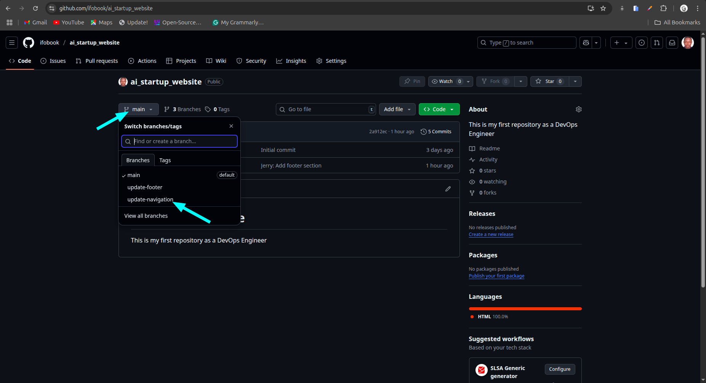

## 3. Create New Pull Request
   - Click on the **"Pull requests"** tab at the top of the repository page.
   - 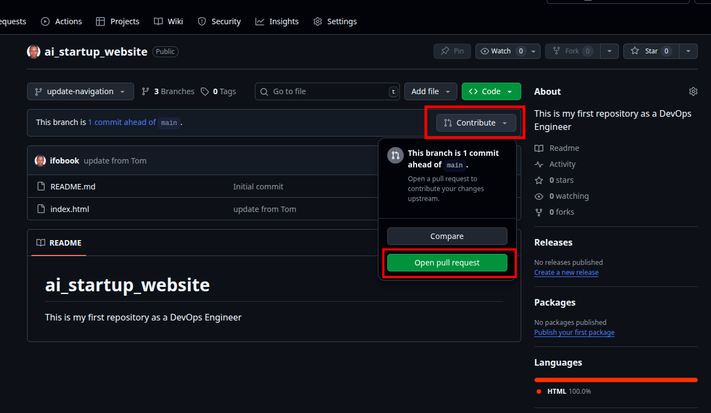
   - Github will take you to a new page to initiate a pull request. It automaticallly selects the **main** branch as the base and your recent pushed branch as the compare branch.

## Review Tom's Changes
   - Before creating the pull request, Tom will review his changes to ensure everything is correct. GitHub shows the differences between the base brance and Tom's branch. It's a good opportunity for Tom to double-check his work.

## Creating the Pull Request
   - If everything looks good, click the **"Create pull request"** button.
   - Provide a title and description for the pull request. This helps other team members understand what changes Tom has made and why.
   - After filling in the information, **"Create pull reguest"** again to officially open the pull request.
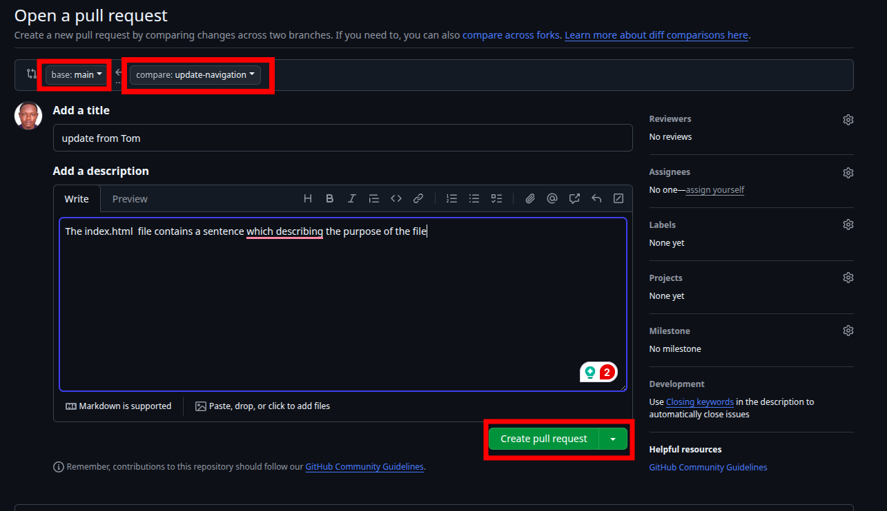

## Reviewing and Merging Pull Requests
Once the pull request is created, it becomes visible to other team members who can review the changes, leave commentts, and request additional modifications if necessary (This is an example of what collaboration is about in DevOps). When the team agrees that the changes are ready  and good to go, someone with merge permissions can merge the pull request, incorporating the changes from Tom's update-navigation branch into the main branch.
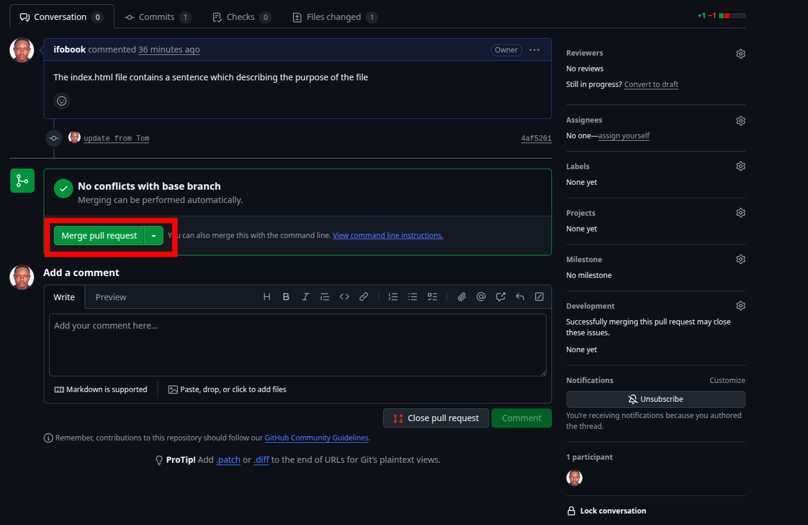
Confirming the merge will update the main branch with Tom's changes, and the pull request will be closed automatically.
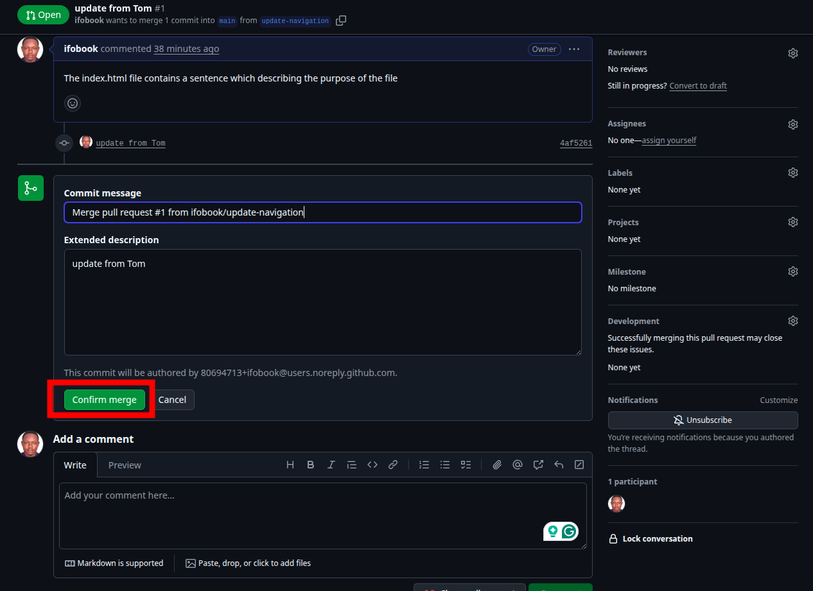
Merge completed successfully.


Following the same process, Jerry would create a pull request for his **update-footer** branch after Tom's changes have been merged, ensuring that the project stays up to date and conflicts are minimized.

## Updating Jerry's Branch with Latest Changes
Before Jerry merges his changes into the main branch, it's essential to ensure his branch is up-to-date with the main branch. This is because other changes (like Tom's updates) might have been merged into the main branch after Jerry started working on his feature. Updating ensures compatibility and reduces the chances of comflicts.

## Steps to Update Jerry's Branch:
   - On the terminal, Switch to Jerry's Branch:
```bash
      git checkout update-footer
   ```
- Pull the latest changes from the Main Branch
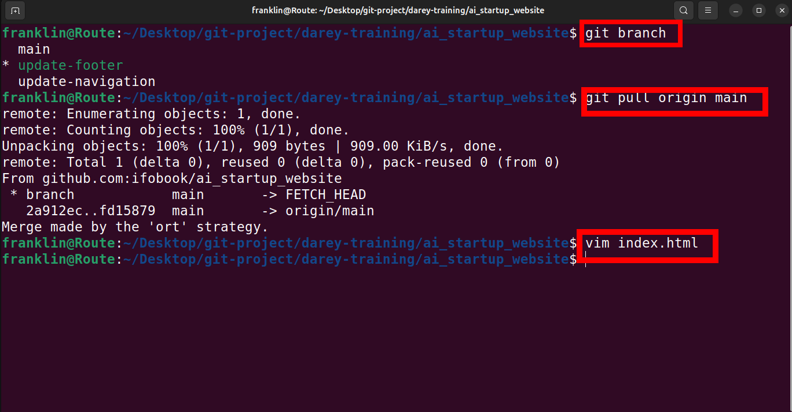

Pupose: This command fetches the changes the **main** branch (remeber, main branch now has Tom's changes) and merges them into Jerry's **update-footer** branch. It ensures that any updates made to the main branch, like Tom's merged chsnges, are now included in Jerry's branch. This step is crucial for avoiding conflicts and ensuring that Jerry's work can smoothly integrate with the main project.

- Merge the pull request to the main branch: Click the **"Merge pull request"** button to merge Tom's changes into the main branch. This action combines Tom's contributions with the rest of the project, completing the collaborative workflow.

## Finalize Jerry's Contribution
Assuming there are no conflicts, Jerry's branch is now ready to be merged back into the main project.
- Push the Updated Branch to GitHub
```bash
      git push origin update-footer
```
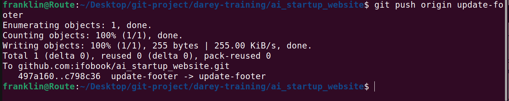
This command uploads Jerry's changes to GitHub. Now, his branch reflects both his work and the latest updates from the main branch.

The **Origin** keyword in the command refers to the default name Git gives to the remote repository from which you cloned your project. It's like a shortcut or an alias for the full URL of the repository in GitHub.

- Create the Pull Request (PR) for Jerry's changes, similiar to how you did for Tom.
- Merge Jerry's Pull Request. Complete the  process by merging the PR into the main branch.
- 
## Selecting Jerry's branch.
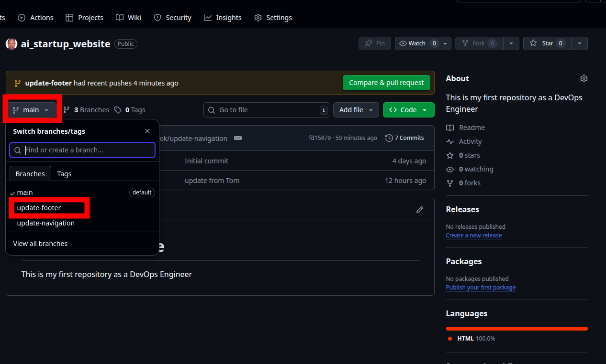

## create a Pull Request on GitHub:
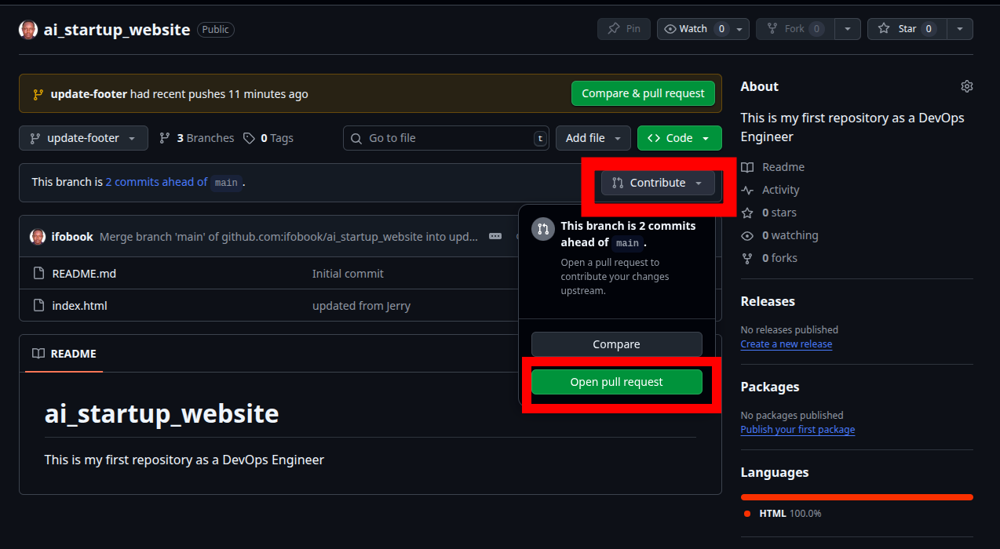

## Creating the Pull Request
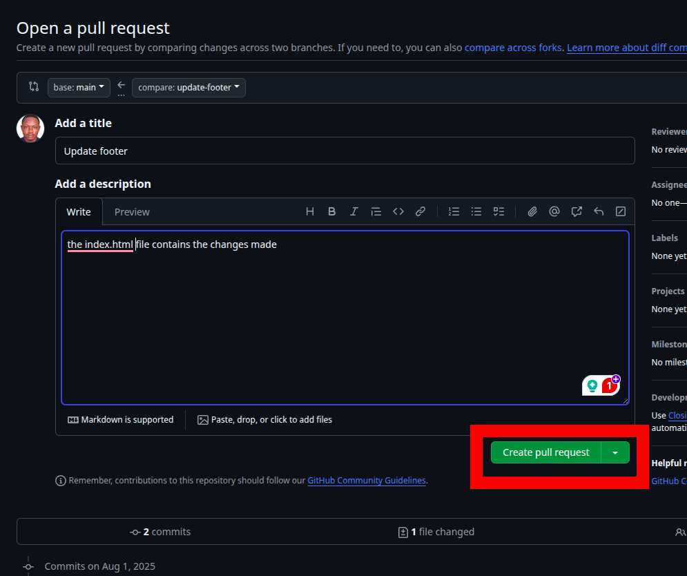

## Reviewing and Merging Pull Requests
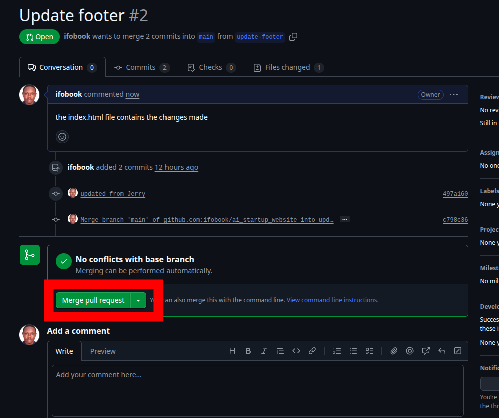
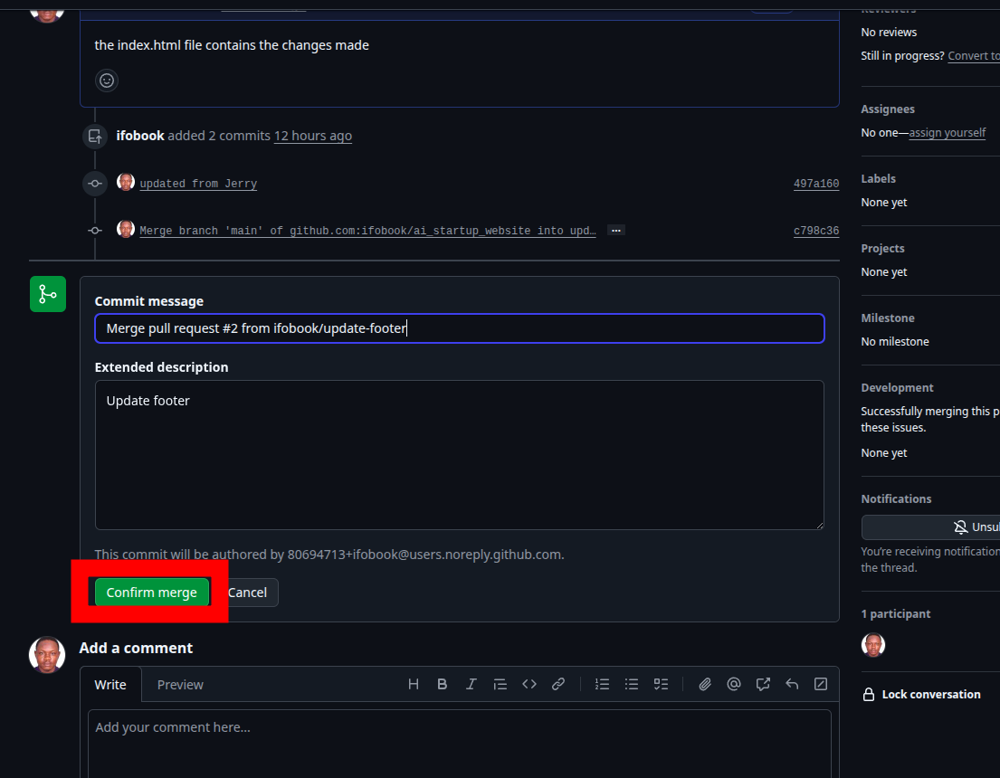
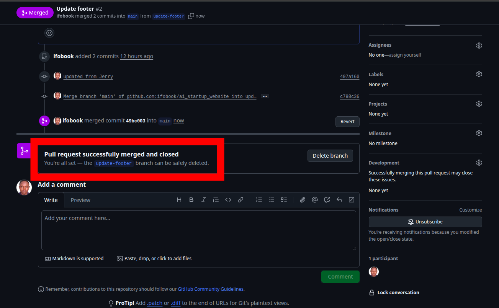
 
This simulated workflow illustrate how Git facilitates collaborative development, allowing multiple developers to work simultaneously on different aspects of a project and merge their contributions seamlessly, even when working on the same files.


